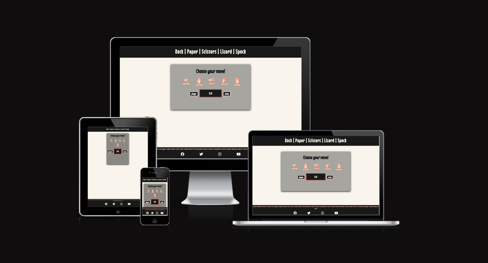
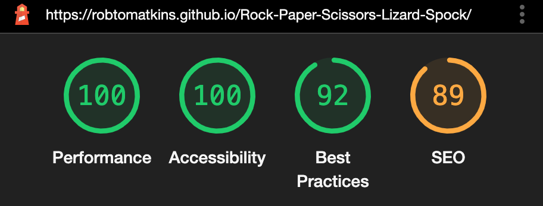
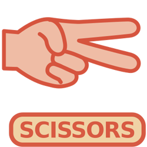
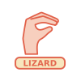
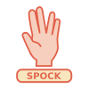
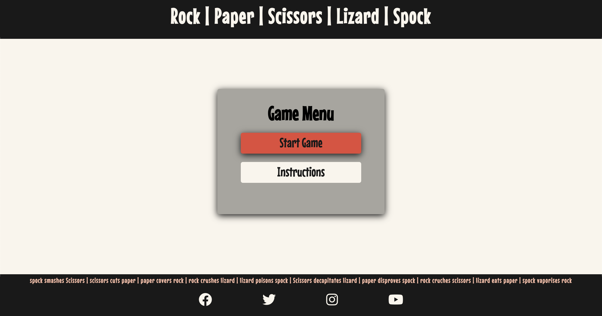
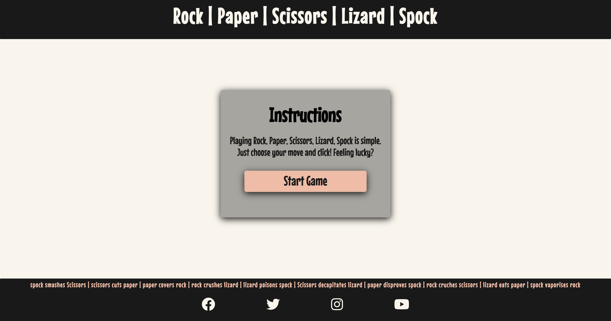
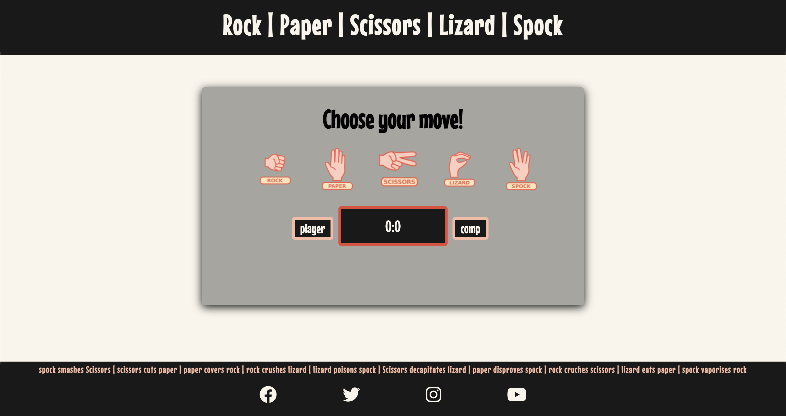

# **Rock-Paper-Scissors-lizard-Spock**
## JavaScript Portolio Project
 
Rock-Paper-Scissors-Lizard-Spock is a fun, interactive game, with an element of chance. As the player, you will face off against the computer, no skill is needed as the computer choice is selected at random through the use of JavaScript. The game is fully repsonsive, and can be accessed quicky via a mobile device if needed. 
 
 

### [**View Live Site**](https://robtomatkins.github.io/Rock-Paper-Scissors-Lizard-Spock/)

 

# Table of Contents

- [**UX**](#ux)
    - Overview
    - Color Story
    - Fonts
    - Images
    - Hover Size Increase on Controls
        
- [**Site Structure**](#site-structure)
    - Index/Home Page Contents
    - Instructions Page Contents
    - Game Page Contents
    - Technologies
- [**Site Features**](#site-features)
    - The Game Message Area
    - The Game Controls Area
    - The Scoreboard Area 
    - The Footer
- [**Testing**](#testing)
    - Bugs
    - Responsive Testing
        - Web dev tools
    - Performance Testing
        - Lighthouse
    - Validation Testing
        - W3C HTML & CSS
    - Brower Testing
        - tested in firefox, safari and chrome
- [**Deployment**](#deployment)
- [**Credits**](#credits)
    - Content
    - Media 
- [**Project Screenshots**](#project-screenshots)

# UX

- ## Overview 
    - The site has been designed to have an ineractive, fun and non-static feel. I have aimed to create an informal deisgn feel through the use of selected font styles and bright colour scheme. 
     
    Design elements run consistently throughout all three pages, such as the hero image (different image but same size), navigation bar, footer and colour scheme. The 'walks' and 'about' section both have the same layout but have different imagery for the text box backgrouds. 
 

- ## Colour Story 

    - #f9f5ec; Off White
    - #191919; Dark grey
    - #a7a59e; Light Grey
    - #d6543e; I obtained this colour by using the colour picker tool on the controls images - allowing me to use a consitent colour story thoughout the site.
    - #f0d2a5; I obtained this colour by using the colour picker tool on the controls images - allowing me to use a consitent colour story thoughout the site.
 

- ## Fonts
    - Downloaded from [Google Fonts](https://fonts.google.com/). I chose Mouse Memoirs for it's informal, dynamic feel, contributing to the overall game like feeling of the app. 
 

- ## Images
    - Images were obtained from [OPENCLIPART](https://openclipart.org/detail/325665/rock-paper-scissors-lizard-spock).
 

- ## Hover Size Increase on Controls 
    - This attribute is used to make it clear to the user which button they are pressing - it also contributes the interactive feel of the game
 

[**Back to table of contents**](#table-of-contents)

# Site Structure 

- ## [Index/Start Screen](https://robtomatkins.github.io/Rock-Paper-Scissors-Lizard-Spock/)
    - The start screen is the landing page for the game
    - You have the option to either being the game or read the instructions
    - Two buttons are in place with hover feature to change colour and provide clarity to user
     
     
- ## [Instructions Screen](https://robtomatkins.github.io/Rock-Paper-Scissors-Lizard-Spock/instructions.html)
    - The instructions screen is a simple screen accessible from the landing page
    - This screen provides clear instruction about how to the play to game
     
     
- ## [Game Screen](https://robtomatkins.github.io/Rock-Paper-Scissors-Lizard-Spock/game.html)
    -  The game screen is the main page of the site
    -  This screen contains the JavaScript interactive elements of the game
     
     
- ## Technologies
    - JavaScript
    - HTML5
    - CSS
    - Git
    - Github 
    - Font Awesome
    - Google Fonts
     
     

[**Back to table of contents**](#table-of-contents)

# Site Features

- ## [The Game Message Area](#project-screenshots) 
    - The game message area displays a message to the user once the game function has run. It will show either win, lose or draw. This provides an interactive element and contributes to the game feeling of the app. 
     
     
- ## [The Game Controls Area](#project-screenshots) 
    -  The game controls area consists of 5 images displaying the different control choices of rock, paper, scissors, lizard and spock. They are a visual reprisentation of the rules and contribute to the game feeling of the app.
     
     
- ## [The Scoreboard Area](#project-screenshots) 
    - the Scoreboard area displays the score of both the player and the computer, incrementing the score by 1 when either side wins, and by 0 in the instance of a draw. 
     
     

[**Back to table of contents**](#table-of-contents)

# Testing

- I have tested the site to ensure it is fully repsonsive on mobile devices, ipads, laptops and desktops. I used devtools to do this. 

- I have tested that the website works in Safari, Chrome and Firefox.
 
 

- ### Bugs
    - No bugs found
     
     
- ### Validator Testing
    - HTML
        - No errors detected when code input into W3C validator.
    - CSS 
        - No errors detected when code input into W3C CSS validator.
    - JavaScript
        - No errors detected when code input ito JSHint JavaScript Validator.
    - Accessibility 
        - I have checked the site is accessible by running it through lighthouse in devtools.
         
         
- ### Functuality Testing
    - JavaScript Functions
        - I have tested that the JavaScript functions are working correctly by pressing each control selector until win, lose and draw scenario occurs.
 
    - Social Media Links
        - I have checked that all links to external sites open in new tab, confirming that the _blank attribute is functioning. 

    - Page Anchor Links
        - I have checked that all anchor links direct the user to the correct page

 
 

[**Back to table of contents**](#table-of-contents)

# Deployment

- The site was deployed to Github pages. The steps for depoyment were as follows:
    - I went to the settings tab in in Github Repository, and then to the pages section.
    - I then selected the main branch from the source drop down menu.
    - I was then provided with a link to published website.
    - Live site can be found [here](https://robtomatkins.github.io/Rock-Paper-Scissors-Lizard-Spock/)
 
 

[**Back to table of contents**](#table-of-contents)

# Credits

- ### Content
    - The code to make the social media links in the footer was taken from the CI Love Running Project
    - The template used on github is the CI full template

- ### Media
    - The images for the controls buttons were taking from [OPENCLIPART](https://openclipart.org/detail/325665/rock-paper-scissors-lizard-spock)
        - 
        - 
        - 
        - 
        - 

- ### Guides and Tutorials
    - [W3schools.com](https://www.w3schools.com/howto/default.asp) for design guides and tutorials

    - [freeCodeCamp.org](https://www.youtube.com/watch?v=jaVNP3nIAv0) To write my JavaScript code I have followed along with the Web Development Tutorial - JavaScript, HTML, CSS - Rock Paper Scissors Game, on freeCodeCamp.org.
    I have used this tutorial as a guide to gain a better understanding of functions, and have changed and built on the code along the way include the Spock and Lizard elements of the game. 

- ### README.md
    - [Marcin-Kli/MP1](https://github.com/marcin-kli/MP1/blob/Milestone-Projects/README.md#surface) READ.md from 'Annies Portfolio wesbite' used as guide
 
 

[**Back to table of contents**](#table-of-contents)
 

# Project Screenshots

- **The Start Game Screen**

 

- **The Instructions Screen**

 

- **The Game Screen**

 

[**Back to table of contents**](#table-of-contents)
 

